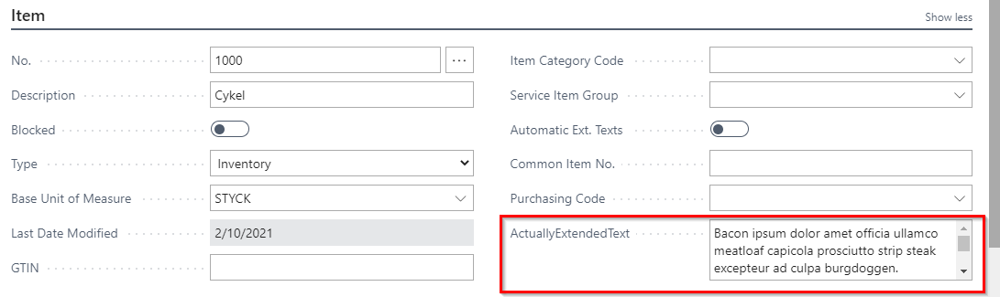
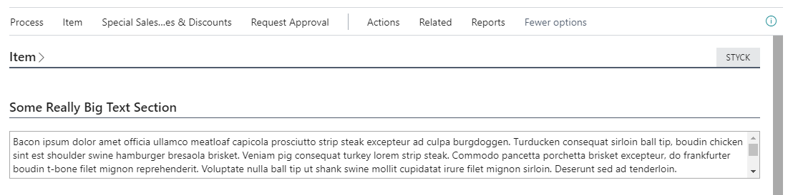
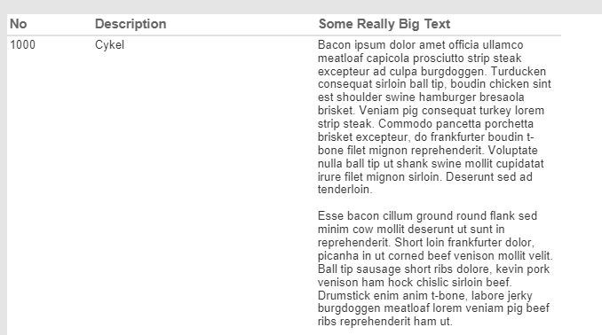

# Spare Brained Ideas - Demo BigText
Demonstrating use of the BLOB Memo content on Pages and Reports in Microsoft Dynamics 365 Business Central.

## Table

The Table getting the BLOB field also gets helper Getter/Setter type functions

## Page

The Page displaying the BLOB gets a Variable to store the Text data.  We load the Text Var OnAfterGetRecord from the getter.  We also push the data back in the OnValidate of the field.



### Option - Big Field

When you include this on a page, the default I used in the demo code is a multiline field within the standard layout, which doesn't show much information to the user.

If you use this field in a group by itself with the Caption disabled, it will visually occupy a lot more height and width.



```al
layout
    {
        addafter(Item)
        {
            group(BigText)
            {
                Caption = 'Some Really Big Text Section';
                field(ActuallyExtendedText; ActuallyExtendedText)
                {
                    ApplicationArea = All;
                    MultiLine = true;
                    ShowCaption = false;

                    trigger OnValidate()
                    begin
                        Rec.SetActuallyExtendedText(ActuallyExtendedText);
                    end;
                }
            }
        }
    }
```

Sadly, there's no way to request the control be larger than the default height (at the time of writing this, on 17.4).

## Report

If you load a Text Variable from the Getter the same way, you can include the BLOB content in the Report Data.



### Caveats

Use this very carefully, as BLOB content can quickly make report datasets balloon to be too large.
